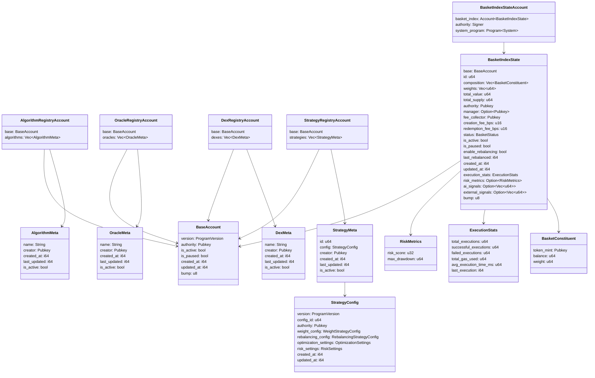
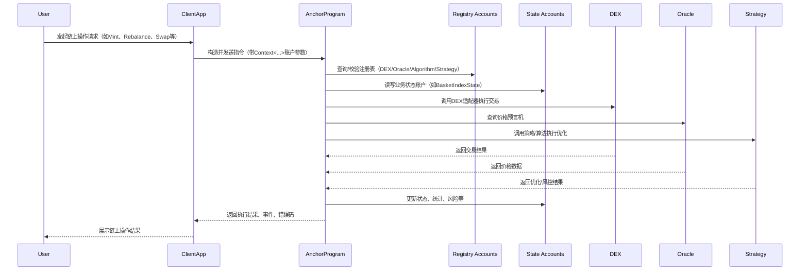
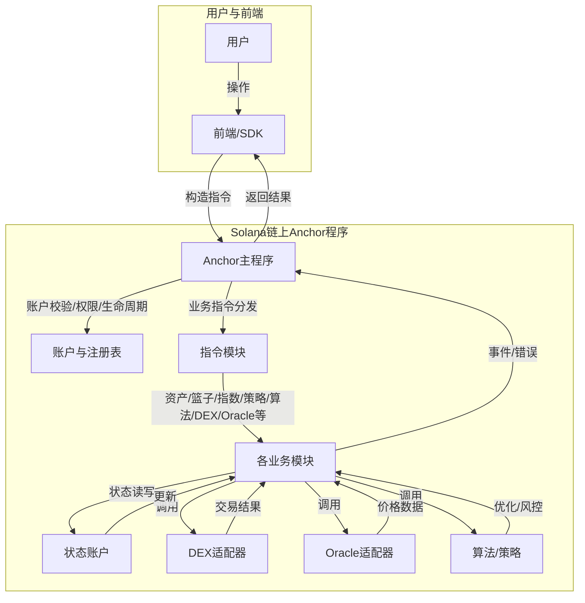

# Solana Anchor 合约架构设计文档

---

## 1. UML架构类图

---

## 2. 组件调用时序图

---

## 3. 功能流程图

---

## 4. 详细功能流程与指令说明

### 4.1 账户与注册表
- **BasketIndexStateAccount**：统一资产、篮子、指数账户，PDA唯一，持久化业务状态。
- **AlgorithmRegistryAccount / OracleRegistryAccount / DexRegistryAccount / StrategyRegistryAccount**：全局注册表，动态管理算法、预言机、DEX、策略的元数据与激活状态。

### 4.2 指令分组与流程
- **资产指令**（mint, burn, transfer, buy, sell, swap, authorize, combine, split, freeze, unfreeze, 批量/策略/执行等）
- **篮子指令**（rebalance, pause, resume, transfer, buy, sell, swap, authorize, combine, split, freeze, unfreeze, 批量/策略/执行等）
- **指数代币指令**（mint, burn, transfer, buy, sell, swap, authorize, combine, split, freeze, unfreeze, 批量/策略/执行等）
- **策略/算法/DEX/Oracle注册与切换指令**（register, query, switch, init）

每个指令均严格采用`Context<...>`账户参数，自动校验权限、生命周期、PDA，所有业务逻辑下沉到service层，指令层只做参数与账户校验、事件触发。

### 4.3 业务流程
- 用户通过前端/SDK发起操作，前端构造Anchor指令，带上Context账户参数。
- Anchor主程序统一入口，分发到具体指令模块。
- 指令模块校验账户、参数，调用service层业务逻辑。
- 业务逻辑可动态调用注册表中的算法、DEX、Oracle、策略等适配器。
- 状态变更写入PDA账户，事件emit，错误码返回。
- 支持批量操作、策略融合、算法热插拔、DEX/Oracle动态切换。

---

## 5. 账户与状态建模说明

- **所有状态账户均实现BaseAccount通用字段**，支持版本、权限、激活/暂停、时间戳、PDA bump等。
- **BasketIndexState**为资产/篮子/指数的核心状态，支持成分、权重、NAV、供应、权限、费用、状态、统计、风险、AI信号等。
- **注册表账户**统一管理元数据，支持动态扩展、权限控制、生命周期管理。

---

## 6. 模块与组件分层说明

- **accounts/**：所有链上账户结构体，PDA建模，类型安全。
- **state/**：核心状态结构体、通用类型、NAV/费用/再平衡/统计/风险等trait实现。
- **core/**：常量、trait、工具、注册表、校验、安全、宏等基础设施。
- **algorithms/**、**strategies/**：算法与策略实现，支持AI/ML/遗传/动态规划/风控/优化等。
- **dex/**、**oracles/**：DEX/AMM与预言机适配器，支持多链多源。
- **instructions/**：所有链上指令实现，分组清晰，严格Context账户参数。
- **services/**：业务逻辑服务层，解耦指令与状态操作。
- **utils/**、**validation/**：通用工具与业务校验。

---

## 7. 合约最佳实践与安全合规性说明

- **严格遵循Anchor 0.31.1语法**，所有账户/指令/事件/错误均采用Anchor宏声明。
- **PDA账户唯一性与权限校验**，防止重放与未授权操作。
- **所有参数类型安全、边界校验、错误处理、事件日志齐全**，便于审计与合规。
- **支持批量操作、策略融合、算法热插拔、DEX/Oracle动态切换**，提升灵活性与可扩展性。
- **代码注释极致细致，便于审计、维护、二次开发**。
- **模块化、分层、可插拔架构，便于未来业务扩展与升级**。

---

## 8. 文档合并与保存建议

建议将本文件保存为`ARCHITECTURE.md`或`docs/architecture.md`，以便团队查阅、审计、合规与二次开发。 